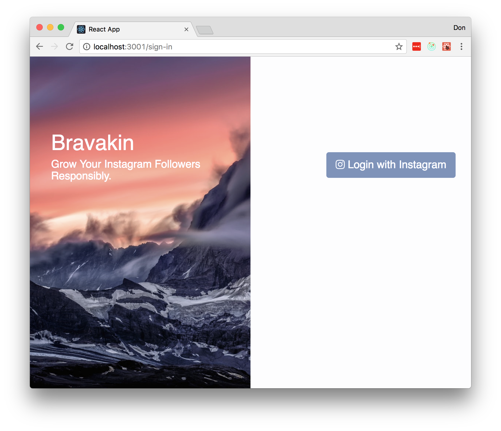
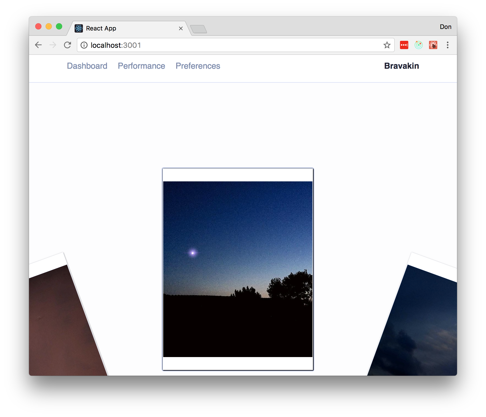
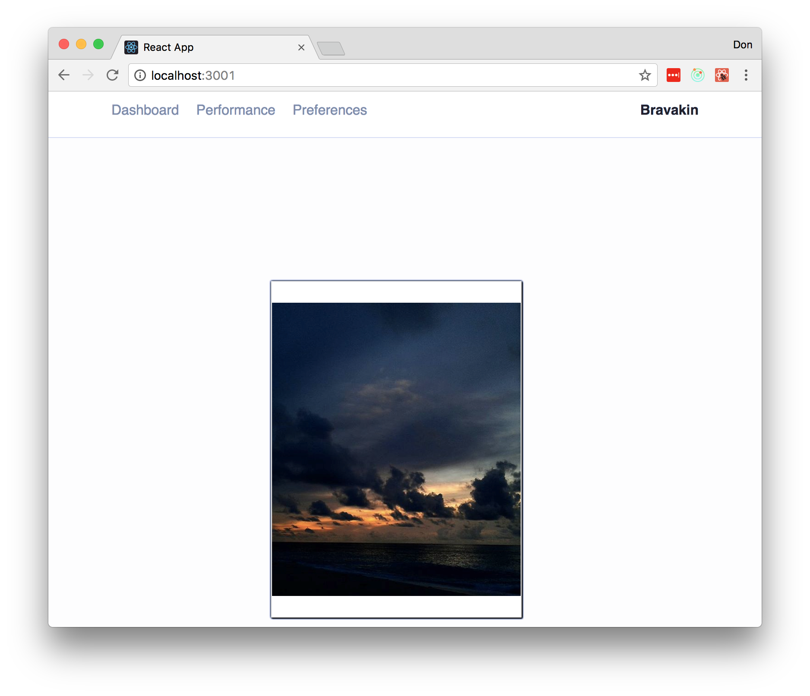
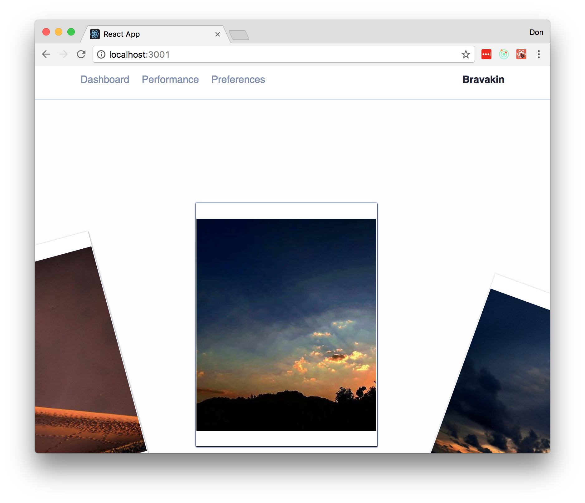
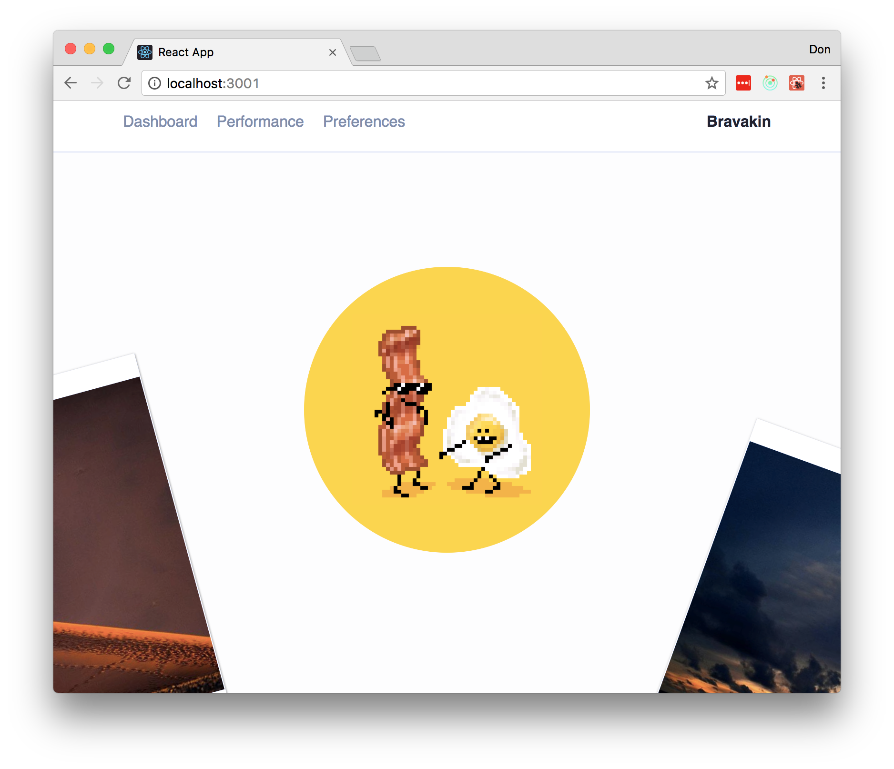
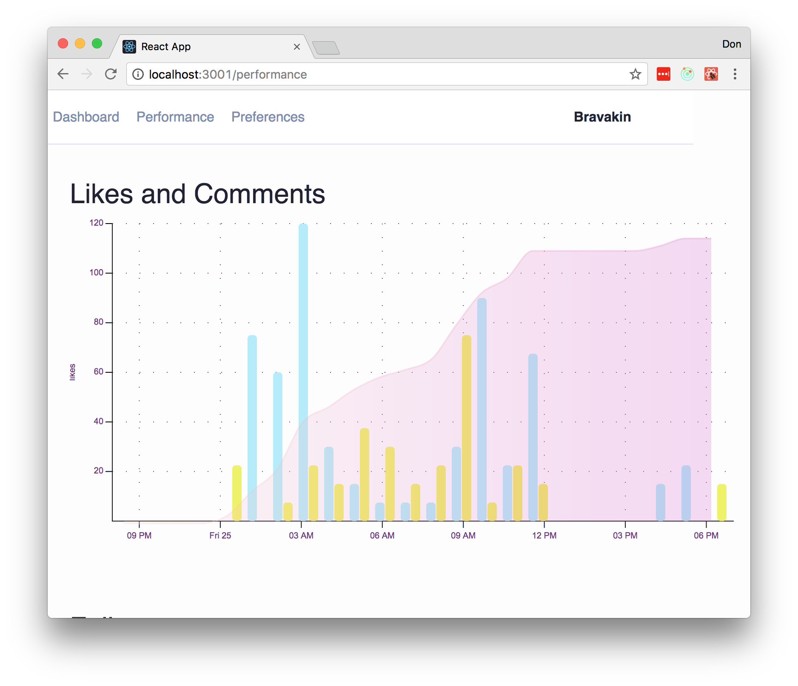
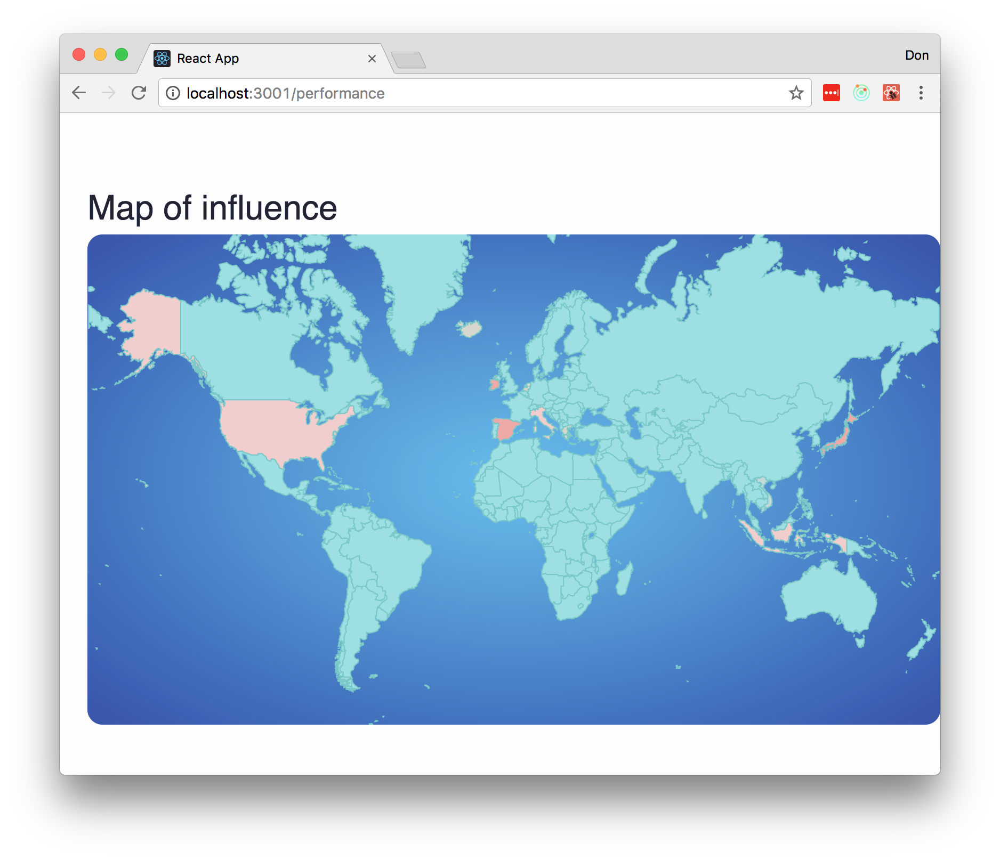

# BravaKin

## Description
Grow Your Instagram Followers Responsibly
Add topics

## Installation

After forking and cloning the repo:

The app divided in two parts:
* /server/
  `$npm install`
  `$nodemon app.js`
* /client/
  `$npm install`
  `$npm start`

## Tech Stack

The app has been created using
- Koa : [koajs.com](http://koajs.com)
- MongoDB: [https://www.mongodb.com/](http://docs.sequelizejs.com/en/v3/)
- React : [facebook.github.io/react/](https://facebook.github.io/react/)

## Contributors

We love pull requests from everyone. By participating in this project, you agree to abide by the thoughtbot
[code of conduct]: https://thoughtbot.com/open-source-code-of-conduct

Fork, then clone the repo:
Push to your fork and  [submit a pull request].

## License

`BravaKin` is licensed under the [MIT](http://www.opensource.org/licenses/mit-license.php)  license.
